<h1>Smart Robotics Palletizer</h1>

Palletizing pattern generator, generates pattern data and palletizing routines according to user settings

<h2>Introduction</h2>

The repository provides a web-based application designed to generate palletizing patterns for robotic systems. It allows users to input various parameters and generates optimized palletizing patterns based on those inputs.

The application contains 5 main functional modules:
1. **Genearte Pattern**: This module provides a user-friendly interface for users to input their palletizing parameters, such as box dimensions, pallet size, and other relevant parameters.
2. **Routines**: This module generates the approach and retract routines for the robotic palletizer based on the waypoints defined by user.
3. **Edit Layer**: This module allows users to modify the generated palletizing patterns, including adjusting box positions and orientations.
4. **Multi Gripper**: This module supports the configuration of multiple grippers for the robotic palletizer, allowing for more complex palletizing operations.
5. **Palletizer Control**: This module provides control functionalities for the robotic palletizer, including pre-teached points setting, robot reachability verification.

Meanwhile, the repo also provides TIA Portal library for user to quickly set up a palletizing master controller (tested with S7-1214, S7-1511). For simple robot pick-and-place palletizing, with help of this library, user can quickly set up a palletizing project with minimum programming effort.

Additional documentation and user guides can be found in the `docs` folder of the repository.

<h2>How to Use</h2>

**First Step: deploy web generator**

The repository provides deployment files in the `deploy` folder, follow the normal way to deploy it as a web application on IIS server.

Prerequisites:
- Install IIS server on their machine. 
- Install the [.NET Core Hosting Bundle](https://dotnet.microsoft.com/en-us/download/dotnet/9.0) to ensure the application runs smoothly.

Refer to [web deploy on IIS](https://learn.microsoft.com/en-us/iis/install/installing-publishing-technologies/installing-and-configuring-web-deploy-on-iis-80-or-later) to deploy the folder `deploy` as a website. After the website runs, users can access to all the functionalities via web browser.

**Second Step: run PLC project**

The design logic is to use a SIMATIC PLC as the palletizing master controller, to coordinate palletizing process and control other devices (e.g. robot arm, conveyor, grippers). 

The web application will generate palletizing patterns and routines, then send the data to the PLC via OPC UA or WebServer API. The PLC will then control the robot to execute the palletizing tasks based on the received data.

You will find the TIA Portal library and template project in `assets` folder.

**Third Step: debug with RoboDK** *(optional)*

The repository also provides several RoboDK simulation projects to help user debug and visualize the palletizing process before deploying to real robot. RoboDK will exchange data with PLC via OPC UA, so make sure to install `opcua` package with Python script.

The RoboDK projects are located in the `assets` folder within the repository. Open the desired project file in RoboDK to start simulating the single-gripper or multi-gripper palletizing.

<table>
	<tr>
		<td>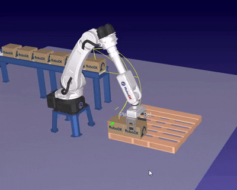</td>
		<td>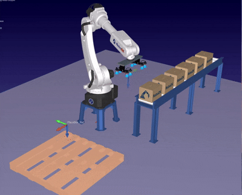</td>
		<td>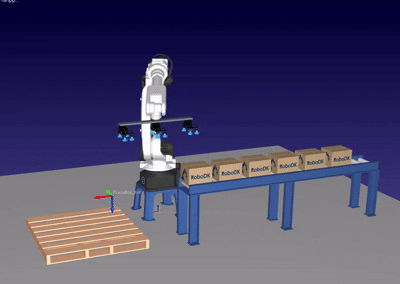</td>
	</tr>
</table>

<h2>Get Start with Web Generator</h2>

<h3>Genearte Pattern</h3>

1. Load tge default configuration "Pattern_1" in the palletizing pattern dropdown box, then clone a new pattern configuration based on it.
2. Modify the size and mode in the new pattern configuration.
3. After completing the configuration, click "Generate" to see the current layer layout and distribution.

*Since each pattern configuration contains parameters for the pallet, product, interlayer, and pattern, users need to clone from the default template first, then modify to get a new configuration.*

<h3>Routines</h3>

When using robot palletizing, the robot¡¯s path for approaching and retracting from the placement position can be set in this module, and transition points can be added to optimize the path.

1. Select a path to configure, or clone from a path template to create a new path configuration.
2. Path points can be set as absolute or relative. Absolute path points use the pallet coordinate system as reference frame and are absolute positions; relative path points use the placement point as reference and are relative positions.
3. You can set separate paths for each item and interlayer, and edit them in the "Layer Layout" module.

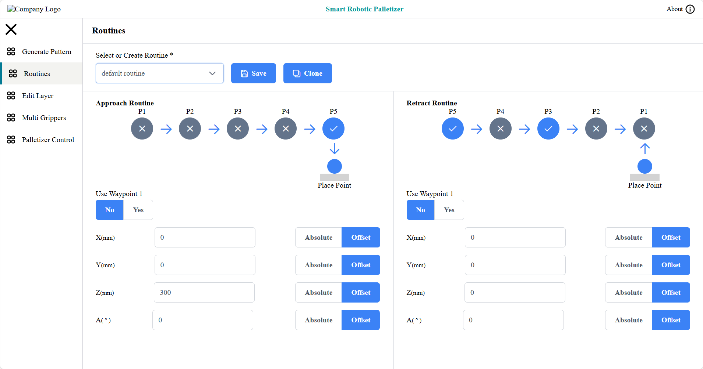

<h3>Edit Layer</h3>

In "Generate Pattern" module, the pallet patterns generated from configurations can be customized and modified in this module to create user-defined solutions.

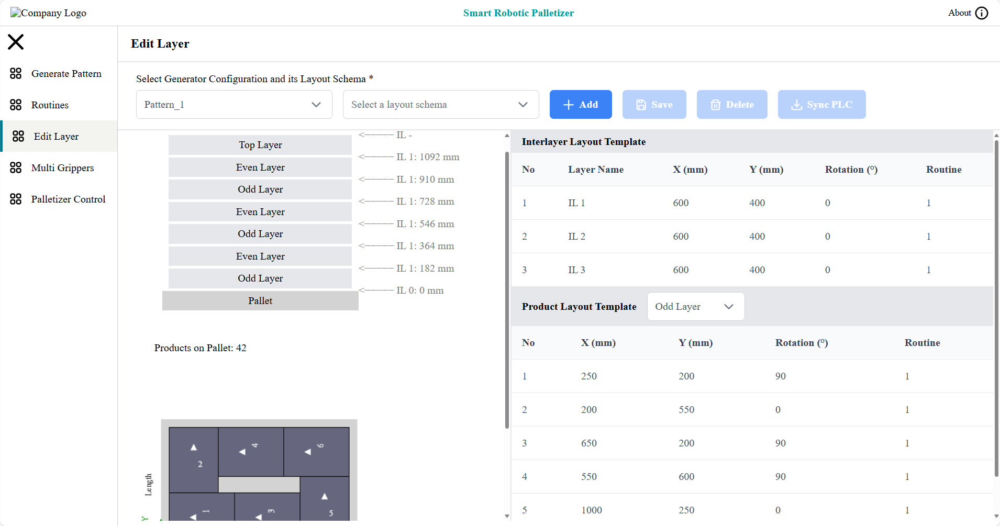

1. Select the pattern configuration and add a new user layout schema.
2. The new layout schema uses the default configuration. Users can click the table data on the right side of the page to modify parameters. The modified parameters will be applied to the related layers.

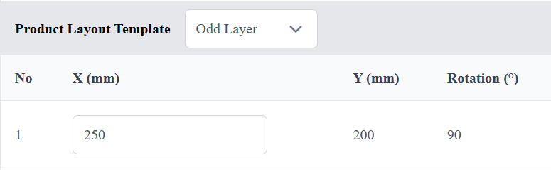

The top left graphic on the page shows the current palletizing layer layout and distribution, as in the picture below: the current pallet has 7 layers, the first (bottom) layer is an odd layer (refers to the layout template used), the last (top) is the top layer (layout template), and the interlayer is IL1 (interlayer layout template).

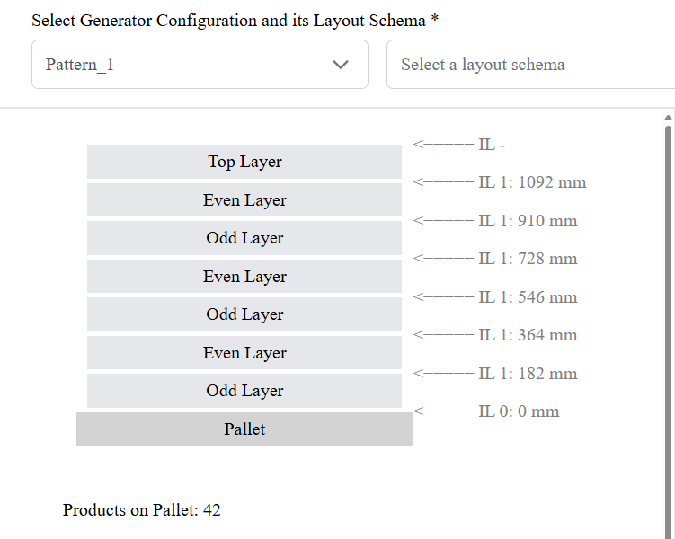

The parameters modified in a layout template (such as odd layer or IL1) will be applied to every layer that uses that layout template. 

Then after completing the custom layout plan, you can download the configuration to the PLC data block through the "Sync PLC" button.

<h3>Multi Gripper</h3>

This module is used to calculate palletizing paths for scenarios involving multiple picks at one time.

1. Select the configured grouping configuration and user solution.
2. Set the number of grippers, offset direction, and offset amount. The offset direction is determined by the incoming parts, and the offset amount is the projected distance referenced from the robot end flange center.

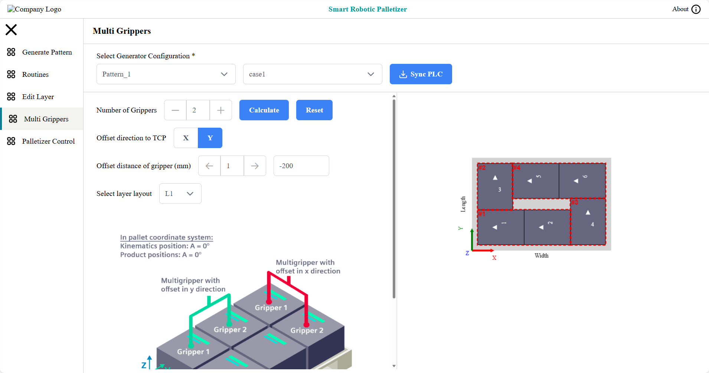

*The red rect-highlight shows the place sequence, parts are circled together show that those parts can be placed without intermediate wayopoint*

<h3>Palletizer Control</h3>

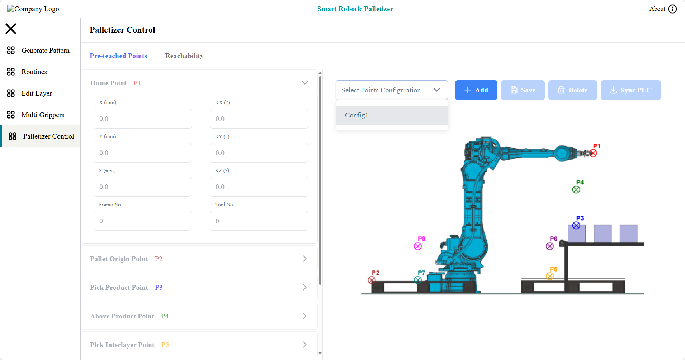

Used to configure static position data that needs to be pre-teached, including initial position (Home), pallet origin, part picking point, above the part picking point, interlayer picking point, above the interlayer picking point, etc.

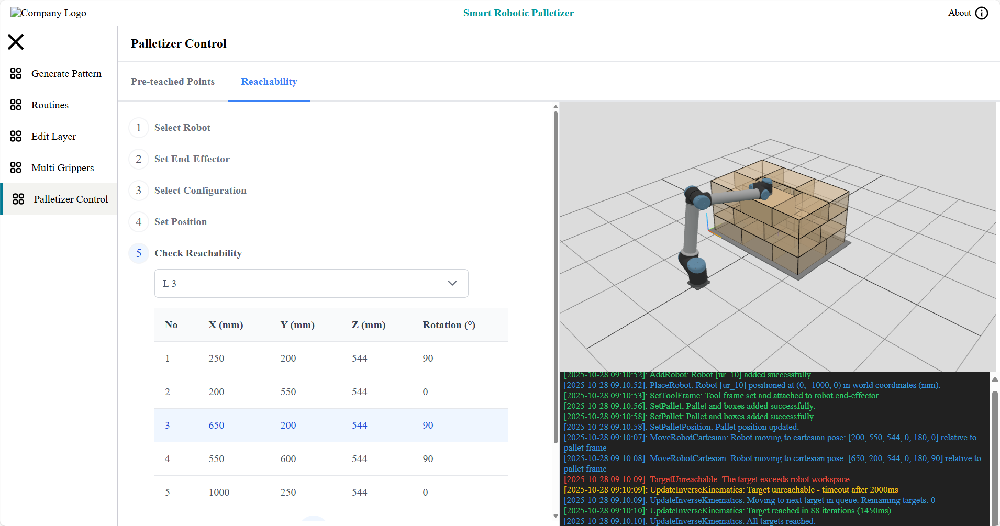

Used to verify the robot, pallet, end tools, and palletizing configuration, and evaluate whether the robot can reach the target stacking position.

<h2>Get Start with TIA Portal Library</h2>

1. Create a new project in TIA Portal (the palletizing control library is currently version V19) and import the library.
2. Enable the OPC UA server of the PLC.

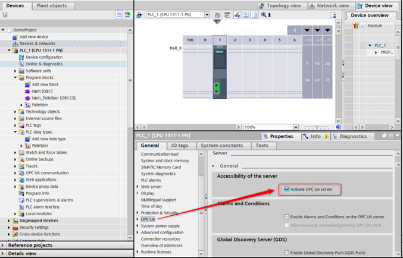

3. Copy the contents of the imported palletizing control library to the current project (drag to the corresponding folder).

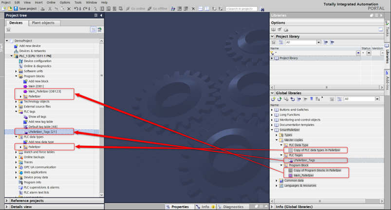

4. Compile the project, modify the input of the "LPalletizer_PalletizingControl" function block, link it to the user's control bit, and set "getNextPoint" to get the target position and position type.

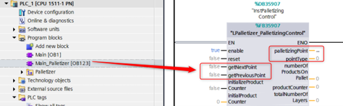

